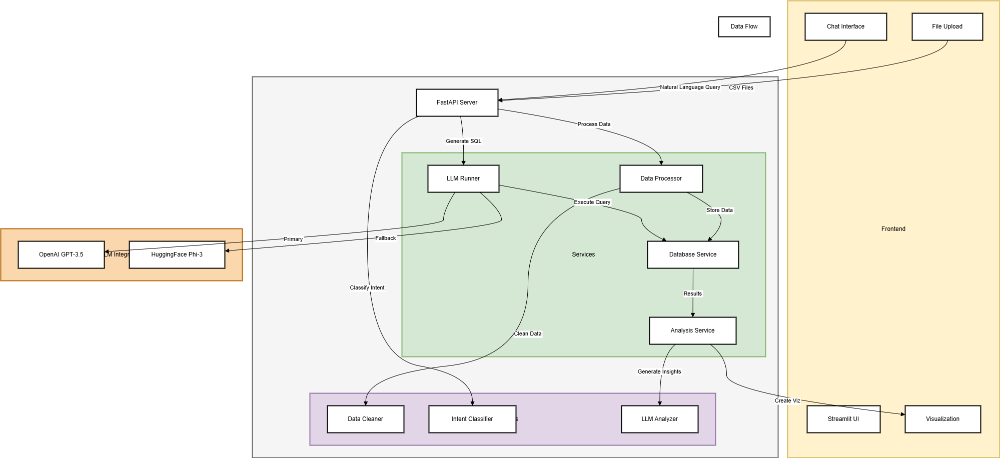

# Flight Data Analysis Assistant

A powerful application that combines natural language processing with data analysis to provide insights about flight booking and airline data.

## Architecture Design



The system architecture diagram above illustrates:
- Frontend components and their interactions
- Backend services and their relationships
- Data flow between components
- Integration points with external services

## Features

- **Natural Language Query Processing**: Ask questions about your flight data in plain English
- **Intelligent Data Analysis**: Automatic detection of query intent (insights or visualization)
- **Dynamic Visualization**: Generate charts and graphs based on your queries
- **Data Quality Analysis**: Automatic assessment of data quality and recommendations
- **Interactive Chat Interface**: User-friendly interface for data exploration
- **Session Management**: Maintain conversation context across queries
- **Robust Error Handling**: Graceful handling of malformed queries and data issues

## Project Structure

```
flight_chat_analyzer/
├── app/
│   ├── routers/
│   │   ├── analysis.py      # API endpoints for data analysis
│   │   ├── chat.py         # Chat interface endpoints
│   │   └── upload.py       # File upload handling
│   ├── services/
│   │   ├── autonomous_agent.py  # Core analysis engine
│   │   └── llm_runner.py        # LLM interaction service
│   └── utils/
│       └── logger_config.py     # Logging configuration
├── frontend/
│   └── app.py              # Streamlit frontend application
├── logs/                   # Application logs
├── uploaded/              # Temporary storage for uploaded files
├── .env                   # Environment variables
├── requirements.txt       # Python dependencies
└── README.md             # This file
```

## Setup

1. **Clone the repository**
   ```bash
   git clone https://github.com/PoornaSaiNagendra/flight-chat-analyzer.git
   cd flight_chat_analyzer
   ```

2. **Create and activate virtual environment**
   ```bash
   python -m venv venv
   source venv/bin/activate  # On Windows: venv\Scripts\activate
   ```

3. **Install dependencies**
   ```bash
   pip install -r requirements.txt
   ```

4. **Set up environment variables**
   Create a `.env` file in the root directory with:
   ```
   GROQ_API_KEY=your_groq_api_key
   ```

5. **Start the backend server**
   ```bash
   uvicorn app.main:app --reload
   ```

6. **Start the frontend**
   ```bash
   cd frontend
   streamlit run app.py
   ```

## Usage

1. **Upload Data**
   - Navigate to the web interface
   - Upload your booking and airline data files (CSV format)
   - The system will automatically analyze the data quality

2. **Ask Questions**
   - Use the chat interface to ask questions about your data
   - Examples:
     - "What are the top three most frequented destinations?"
     - "Show me a trend of bookings over time"
     - "What is the average fare by class?"

3. **View Results**
   - Get insights in natural language
   - View automatically generated visualizations
   - Download analysis results

## Key Components

### Autonomous Agent
- Handles natural language query processing
- Manages data analysis and visualization
- Provides data quality assessment
- Maintains conversation context

### LLM Integration
- Uses Groq for natural language processing
- Generates SQL queries from natural language
- Creates visualizations based on data
- Provides insights and analysis

### Frontend
- Streamlit-based user interface
- Real-time chat interaction
- Dynamic visualization display
- File upload and management

## Error Handling

The application includes comprehensive error handling for:
- Invalid queries
- Data processing errors
- LLM response validation
- File handling issues
- SQL query generation and execution

## Logging

- Detailed logging of all operations
- Log rotation and management
- Separate log files for different components
- Error tracking and debugging information

## Contributing

1. Fork the repository
2. Create a feature branch
3. Commit your changes
4. Push to the branch
5. Create a Pull Request

## License

This project is licensed under the MIT License - see the LICENSE file for details.

## Acknowledgments

- OpenAI for GPT-3.5-turbo
- HuggingFace for Phi-3 model
- FastAPI for the backend framework
- Streamlit for the frontend interface


